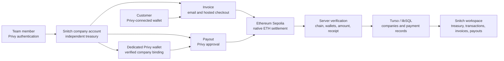

<p align="center">
  <strong style="font-size: 18px;">Snitch:</strong>
  <span style="font-size: 18px;">The operating layer for onchain payments.</span>
</p>

<p align="center">
  <!-- Add the primary Snitch workspace screenshot here later.
  
  -->
</p>

<p align="center">
  
  
  
  
</p>

Snitch is built around one simple idea: company crypto should work like company finance, with clear accounts, controlled access, and a reliable record of every payment.

Moving money onchain is straightforward for one person with one wallet. It becomes much harder when an entire company needs to operate together. Funds sit across personal wallets, payment context lives in spreadsheets and email, and finance teams have to match transaction hashes with invoices by hand. One person often controls the keys while everyone else waits for an update.

Snitch turns that fragmented process into a shared company workspace. A company can create separate accounts for departments, projects, regions, or payment flows. Each account has its own treasury, transaction history, and Privy-secured wallet. Teams can create invoices, email payment links, receive customer payments, send vendor or salary payouts, monitor treasury activity, and export financial records as CSV.

The working prototype completes these flows with native test ETH on Ethereum Sepolia. Balances come from the network, wallet approvals happen through Privy, and Snitch verifies transfers before recording them as successful. The broader product direction includes stablecoin settlement, global payroll, and expanded team permissions.

Try Snitch at https://snitchpay.vercel.app

<!-- Add the public demo video URL here before submission. -->

ETHGlobal ETHOnline 2026 × Privy 🤍

## Privy wallet infrastructure

Privy provides the authentication and wallet layer at the centre of Snitch. Team members sign in through Privy, while protected Snitch API routes independently verify their Privy access tokens before returning company or payment data.

We deliberately separated authentication from treasury creation. Signing in does not generate a wallet. When a user creates a company account, Snitch asks Privy to create a dedicated embedded Ethereum wallet, verifies that it belongs to the authenticated identity, and binds its public address to that account. This gives every account an independent treasury without creating a Snitch-controlled signer.

Privy also handles the actions that require wallet authority. Company payouts open Privy's approval interface for the exact wallet, destination, amount, and Sepolia network. Invoice recipients connect their own Ethereum wallet through Privy and approve the payment from the hosted checkout page. Snitch receives the public transaction hash and verifies the resulting transfer independently.

Key export is protected by an additional application-level check. Snitch issues a five-minute, single-use message containing the company, user, wallet, purpose, nonce, and expiry. The designated wallet controller signs that message with the selected company wallet. Only after the server verifies and consumes the challenge does the client open Privy's protected export interface. The private key and recovery phrase never pass through Snitch.

<p align="center">
  <!-- Add the Privy authentication screenshot here later.
  
  -->
</p>

<p align="center">
  <!-- Add the Privy transaction approval screenshot here later.
  
  -->
</p>

<p align="center">
  <!-- Add the protected wallet export screenshot here later.
  
  -->
</p>

## Credits

Snitch was designed and built by [Ayush Srivastava](https://github.com/ayushshrivastv) for ETHOnline 2026. Privy is the partner technology used for authentication, embedded company wallets, external wallet connections, transaction approval, message signing, and protected key export. Repository import chronology and provenance are documented in the [development history](docs/development-history.md).

## How Snitch Works



Every protected flow begins with a verified Privy identity. Creating an account reserves a company record, captures a baseline of the user's existing wallets, creates one new eligible Privy wallet, and binds it only after server-side ownership checks pass. Request IDs make interrupted setup idempotent, so reopening the flow does not silently create duplicate accounts or wallets.

Invoices always use the selected company's stored receiving address. Snitch saves the amount, customer, purpose, due date, and invoice reference before generating a public checkout link. The recipient does not need a Snitch account: they open the link, connect an Ethereum wallet through Privy, and approve the exact payment.

Payouts begin from the company workspace. Snitch resolves the selected account to its bound Privy wallet, converts the entered ETH amount into integer wei, and requests wallet approval. Once a transaction is broadcast, the hash is retained immediately so a temporary storage or network failure cannot cause the transfer to be sent twice.

Both flows finish at the same verification layer. Snitch checks the Sepolia chain, sender, recipient, exact amount, transaction data, successful receipt, and confirmed block before it updates the workspace. Confirmed invoices and payouts are stored in Turso in production and local libSQL during development.

<p align="center">
  <!-- Add the Snitch payment-flow or architecture screenshot here later.
  
  -->
</p>

## Transaction verification and settlement

Snitch does not treat a button click or client response as proof of payment. A transaction becomes successful only after the backend retrieves it from the configured Ethereum RPC, validates its fields, finds a successful receipt, and confirms that receipt against a canonical block.

Invoice transfers include a small `snitchpay:<invoiceId>` reference in the native transaction data. This gives the prototype an invoice-specific onchain reference without introducing a custom smart contract. Payouts require empty native-transfer data and must originate from the wallet bound to the selected company. A transaction hash is unique across stored confirmations, preventing one transfer from settling more than one record.

Payment states remain visible throughout the process:

```text
Invoice: created → awaiting wallet approval → confirming → succeeded
Payout:  awaiting wallet approval → incomplete → succeeded | failed
```

Unmined transactions remain incomplete. Reverted payouts are recorded as failed, while unpaid invoices remain available until their due date expires. Confirmed records include a direct explorer link so the public onchain transfer can be checked independently.

## Durable records and deletion handling

Production records are stored in a remote Turso database through the libSQL client. Local development uses `.data/snitch.sqlite`. The database stores company metadata, Privy user identifiers, public wallet addresses, invoices, payment confirmations, payouts, and export challenges. It does not contain private keys, recovery phrases, or wallet signing material.

Company, invoice, and payout records are scoped to the authenticated owner. Deleting an invoice or payout removes its stored record and writes a durable deletion marker, preventing later reconciliation from restoring something the user intentionally removed. Deleting a company removes its Snitch records in one database transaction but does not delete, transfer, or modify the underlying Privy wallet.

## Payment recovery and resilience

Snitch separates broadcasting a transaction from recording its result. As soon as Privy returns a transaction hash, the browser retains an owner-scoped recovery record containing public transaction details. The server then verifies and persists that existing transfer. If a request is interrupted, Snitch retries verification with the same hash instead of asking the wallet to send again.

Invoice checkout and company history recheck incomplete transactions when they are opened. A delayed network receipt can therefore move an existing record from incomplete to succeeded after confirmation. Duplicate hashes, mismatched wallets, incorrect amounts, wrong networks, expired export challenges, and reused signing nonces are rejected rather than repaired with assumed data.

## Company workspace

The workspace brings each account's treasury balance, recorded activity, invoices, and payouts into one interface. Live balances are read from Ethereum Sepolia; an unavailable RPC produces an unavailable state rather than a simulated number. Transaction views can be filtered by status, and transaction or payout records can be exported as CSV for further reconciliation.

Every account remains financially distinct. New invoices resolve to that account's verified receiving wallet, new payouts request its corresponding Privy wallet, and persisted records reload after sign-out or deployment. Public showcase records remain separate from a user's company data and do not determine a connected treasury's live balance.

## Run locally

Snitch requires Node.js `22.14` or newer within the Node 22 release line, npm, and a Privy application configured for email authentication. A Sepolia wallet needs test ETH before it can send a payout or pay an invoice.

```bash
npm ci
cp .env.example .env.local
```

Add the required Privy values to `.env.local`, then start the application:

```bash
npm run dev -- --hostname 127.0.0.1 --port 3000
```

Open `http://127.0.0.1:3000`. Local development uses `.data/snitch.sqlite` automatically. Configure Resend only when invoice email delivery is required; configure Turso when testing against a shared remote database.

## Configuration

The complete configuration template is available in `.env.example`.

```env
# Privy authentication and wallet infrastructure
NEXT_PUBLIC_PRIVY_APP_ID=
PRIVY_APP_SECRET=

# Ethereum Sepolia RPC
NEXT_PUBLIC_ETHEREUM_RPC_URL=https://ethereum-sepolia-rpc.publicnode.com
ETHEREUM_RPC_URL=

# Remote production database
TURSO_DATABASE_URL=
TURSO_AUTH_TOKEN=

# Hosted invoice links
SNITCH_PUBLIC_ORIGIN=https://snitchpay.vercel.app

# Optional invoice email delivery
RESEND_API_KEY=
RESEND_FROM="Snitch <onboarding@resend.dev>"

# Optional persistent local database directory
# SNITCH_DATA_DIR=/absolute/path/to/snitch-data
```

Only variables prefixed with `NEXT_PUBLIC_` are exposed to the browser. Privy secrets, Turso tokens, Resend credentials, local databases, and private keys must never be committed. Vercel deployments require Turso because serverless local files are not durable.

## Useful commands

```bash
npm run dev          # Start the local Next.js application with Webpack
npm run build        # Create and validate the production build
npm run start        # Start a completed production build
npm run lint         # Run ESLint across the repository
npm test             # Run the Node and TypeScript test suite
npm run db:migrate   # Initialise or migrate the configured database
npm run check:repo   # Scan tracked files for blocked artefacts and credentials
npx tsc --noEmit     # Validate TypeScript without emitting files
```

## Security and current scope

Snitch currently executes native ETH transfers on Ethereum Sepolia (`11155111`). It does not execute mainnet payments, stablecoin transfers, batch payroll, refunds, or dispute resolution. Base activity shown in the public showcase is historical presentation data rather than a supported settlement network.

The current prototype binds each company wallet to its creator's Privy identity. Snitch applies its own designated-controller check to the normal key-export path, while Privy's authenticated wallet owner retains Privy's independent recovery and export capabilities. Additional roles shown in the Connect interface do not yet create persisted invitations, shared signing rights, approval thresholds, or owner transfer.

Snitch stores the public wallet and payment metadata required to operate the workspace. Public Ethereum transfers remain visible onchain. Snitch does not receive or store private keys and does not maintain a server-side wallet capable of signing company transactions. See [Privy authentication](docs/privy-auth.md), [company wallets](docs/company-wallets.md), [payment settlement](docs/payment-settlement.md), [invoice email](docs/invoice-email.md), and [Vercel database setup](docs/vercel-database.md) for the detailed trust boundaries and operating procedures.

## AI Disclosure

ChatGPT and OpenAI Codex, including the Astra coding model, were used as development tools to help debug wallet integration issues and implement parts of the frontend. AI-generated suggestions and code were reviewed, tested, and integrated by the project developer, who remains responsible for the final architecture and implementation.
